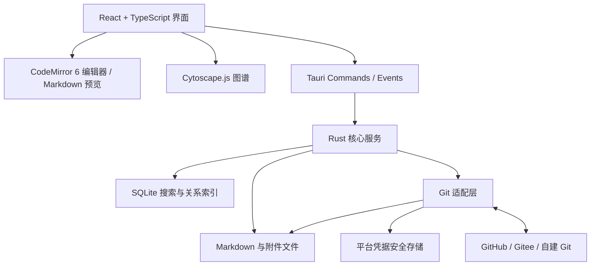

# 基于 Tauri 2 的跨平台 Markdown 笔记软件技术方案

版本：v1.0（设计草案）  
日期：2026-09-15  
目标平台：macOS、Windows、iOS、Android

## 1. 目标与范围

构建本地优先的个人笔记软件：Markdown 文件是内容的唯一事实来源；目录组织笔记；SQLite 提供可重建的搜索和关系索引；Git 提供版本历史与跨设备同步。界面基于 Tauri 2 与 Web 技术，平台无关业务放入 Rust 核心。

本方案是实施设计，不代表各依赖已经在四端完成兼容性验证。依赖版本在技术验证阶段选择并锁定；移动端 Git、中文输入、中文搜索及图谱性能是正式开发前的关键验证项。

### 1.1 必须支持的能力

| 模块 | 功能 |
|---|---|
| 文件与目录 | 创建、编辑、重命名、移动、删除笔记及目录；附件管理 |
| 编辑 | Markdown 源码编辑与预览、自动保存、撤销重做、中文输入 |
| 搜索 | 文件名、正文、TAG、目录过滤及组合查询 |
| Git | 连接 GitHub、Gitee 或自建 Git；克隆、提交、获取、合并、推送 |
| 图谱 | 当前笔记局部图谱、当前笔记库全局图谱、筛选、定位、打开笔记、导出 |
| 跨平台 | 四端可编辑、搜索和手动同步，移动端适配触控与生命周期 |

### 1.2 首版边界

- 单个活动笔记库；每个库对应一个 Git 仓库，使用固定配置的同步分支。
- HTTPS + Token 连接已有远程仓库；不要求服务方提供专用 API。
- 源码编辑与预览，支持 Markdown 链接与 `[[Wiki 链接]]`。
- 离线编辑、手动同步、可选前台自动同步及冲突恢复。
- 支持常见图片附件；大文件同步能力设限并在实测后公布。
- 暂不包含实时多人协作、插件市场、所见即所得编辑、跨库图谱、AI 自动关联、Git LFS、端到端加密、SSH/OAuth 登录和自动创建远程仓库。

## 2. 总体架构



Web 前端负责界面和交互，不直接任意读写文件、不接触长期凭据。Rust 统一执行路径校验、文件写入、索引、链接解析和 Git 操作。桌面与移动平台差异通过存储、凭据、生命周期和导出适配层隔离。

### 2.1 技术选型

| 层 | 选型 | 说明 |
|---|---|---|---|---|
| 应用容器 | Tauri 2 | 使用系统 WebView；需分别验证四端行为 |
| 前端 | React + TypeScript + Vite | 统一组件、路由、状态与响应式布局 |
| 编辑器 | CodeMirror 6 | Markdown 源码编辑；重点测试中文输入、选区与长文 |
| Markdown | Rust `pulldown-cmark` 候选 + 受限渲染层 | 核心统一链接解析；Wiki 链接需语法扩展；预览输出净化 |
| 业务核心 | Rust | 文件、索引、图遍历、同步状态机及平台抽象 |
| 数据库 | SQLite + FTS5，Rust `rusqlite` 候选 | 构建时确认 FTS5 与所选 tokenizer 可用 |
| Git | `git2` / libgit2 候选 | 封装独立接口；四端交叉编译、TLS、认证须先验证 |
| 图谱 | Cytoscape.js | 首版关系交互与布局；性能不达标时评估 Sigma.js + Graphology |
| 凭据 | 各平台安全存储适配 | iOS/macOS Keychain、Windows 安全凭据机制、Android Keystore 保护的加密存储 |
| 验证 | Rust 测试、前端组件测试、Web 端交互测试、四端真机检查 | 浏览器测试不能替代系统 WebView 和移动端验证 |

不能假设任一 Tauri 插件天然支持全部平台；插件或 Rust crate 不满足移动端要求时，补充 Swift/Kotlin 适配。首版不依赖系统 `git` 可执行文件，不启用 Git hooks 或外部凭据辅助程序。

## 3. 文件布局与笔记格式

### 3.1 仓库布局

```text
我的笔记/
├── 工作/
│   └── 项目计划.md
├── 生活/
├── attachments/
│   └── 20260915-a8f3.png
├── .gitignore
└── .git/
```

应用私有数据另存于操作系统应用数据目录，并按库 ID 隔离：

```text
vaults/<vault-id>/
├── index.sqlite       # 可重建索引，不进入仓库
├── recovery/          # 写入及冲突恢复副本
├── layout.json        # 本设备图谱位置缓存
└── state.json         # 同步恢复状态、非敏感设置
```

Token 不进入上述普通文件。Git 仓库同步内容包括笔记、附件和明确允许共享的配置；数据库、锁、布局、设备状态与凭据均不提交。

### 3.2 Markdown 元数据

```markdown
---
id: 8df3a928-1bf4-4c56-b553-5f43c9eea673
tags:
  - 工作
  - 项目
---

# 项目计划

参考 [[产品需求]] 与 [技术方案](../技术/技术方案.md)。
```

- 新建笔记生成 UUID，标题优先取首个一级标题，否则取文件名。
- TAG 以 front matter 的 `tags` 数组为权威来源；首版不从正文任意 `#文字` 推断 TAG。
- 外部笔记没有 ID 时仍可读取和索引；首次需要写回 ID 时保留既有内容并明确记录变更，不在首次扫描时批量改写仓库。
- 对无 ID 文件使用本地身份映射；跨设备、外部重命名后的稳定身份不能保证，路径仍参与解析。
- 检测重复 ID，作为需要修复的元数据问题处理，不能静默合并两篇笔记。
- 编辑元数据时尽量保留未知字段、字段顺序和原有格式，减少无关 Git diff。

### 3.3 文件一致性

采用同目录临时文件写入后替换，并处理平台差异；写入失败时保留恢复副本。保存请求携带读取时的内容哈希，发现外部修改则先协调版本，避免最后写入者覆盖。

统一使用仓库相对路径作为逻辑路径。创建或移动时检查 Windows 保留名、非法字符、大小写冲突和 Unicode 规范化问题；已存在的不兼容路径进入修复提示，不自动改名。阻止路径穿越及符号链接逃逸笔记库。新增文本默认 UTF-8/LF；已有文件尽量保留原有格式。

文件监听用于加速变化发现，不能作为唯一正确性保障；启动、应用回到前台及同步完成后执行增量核对，必要时全量重建。

## 4. 编辑、链接与附件

桌面端使用目录树、编辑区、辅助面板；移动端使用目录页、全屏编辑页和可展开的预览/关系面板。自动保存采用短延迟防抖，切换笔记时刷新待保存内容，并保存可恢复草稿。

### 4.1 链接规则

支持 `[文字](相对路径.md)`、带标题锚点的链接、`[[笔记名]]`、`[[目录/笔记名]]` 和 `[[笔记名|显示文字]]`。

- 标准 Markdown 路径相对当前文件解析，进行 URL 解码和路径规范化。
- 带路径的 Wiki 链接按库根相对路径解析；仅名称的 Wiki 链接先匹配当前目录，再匹配全库唯一名称。
- 多个候选时标记歧义；不任意选择一个文件。
- 指向同一笔记不同锚点的引用在图谱中聚合为一条边，但保留各引用位置。
- 代码块、行内代码及外部 URL 不产生笔记关系；图片附件不作为普通笔记节点。
- 未创建目标保存为未解析引用，可以展示为空心节点；歧义引用与缺失引用分别标识。

采用语法树和源位置解析，避免用全文正则替换链接。应用内重命名或移动时，生成目标文件与入站引用的改写清单，校验文件哈希后执行并保留恢复日志；多文件操作失败时可恢复。外部重命名无法可靠识别时，提示修复失效链接。

### 4.2 附件

附件存放于库内统一目录，文件名防重，Markdown 使用相对路径。复制或导入完成后才插入引用。首版不自动删除看似未被引用的附件，清理操作需提供可检查的清单。普通 Git 会长期保存二进制历史，应限制大附件，避免仓库持续膨胀。

## 5. 搜索与本地索引

### 5.1 逻辑数据模型

| 表 | 核心字段 | 用途 |
|---|---|---|
| `notes` | 本地主键、frontmatter_id、path、title、content_hash、mtime | 笔记目录与变更检测 |
| `links` | source_id、target_id（可空）、raw_target、resolution、source_range | 引用、缺失与歧义状态 |
| `tags` | id、name、normalized_name | 标签规范化 |
| `note_tags` | note_id、tag_id | 笔记与标签多对多关系 |
| `notes_fts` | title、path、body | 全文检索虚拟表 |
| `index_meta` | schema_version、parser_version、last_scan | 索引迁移与重建判断 |

`path` 在当前库内唯一。`links` 保留每次引用，图谱查询时按来源和目标聚合；为来源、目标、路径及标签查询建立索引。文件解析完成后，在单个数据库事务中更新该笔记的正文索引、标签与引用。

### 5.2 查询能力

```text
预算                         # 默认搜索文件名、标题和正文
tag:工作 预算                # TAG 与全文组合
path:项目 tag:工作 预算       # 目录、TAG 与全文组合
```

界面提供独立文件名模式、TAG 筛选和目录筛选，不要求用户掌握语法。查询解析为结构化条件并使用参数化 SQL；FTS 特殊字符通过明确的查询构造处理。结果展示路径、匹配摘要与高亮；初始排序提高文件名和标题命中的权重。

### 5.3 中文检索

首版优先验证 FTS5 trigram 对中文子串搜索的适用性。少于三个字符的查询不能只依赖 trigram MATCH，应采用范围受控的 LIKE/扫描或补充索引，并提示或限制昂贵查询。通过包含一字、二字、多字词、中英文混排和标点的测试集评估召回率及耗时。

若需要更符合词义的排序与分词，再评估中文 tokenizer 或专用检索引擎。不要在尚无实测时承诺 FTS5 默认配置即可满足中文需求。

## 6. Git 同步与历史恢复

### 6.1 同步状态机

```text
Idle → Saving → Committing → Fetching → Integrating → Pushing → Idle
                                │             │            │
                                └→ Error      └→ Conflict  └→ Retry/Error
```

1. 获得库级同步锁，刷新编辑器草稿并确认本地文件保存成功。
2. 仅暂存属于笔记库同步范围的变更，创建本地提交；无变更则跳过。
3. 获取配置分支的远程更新，检查祖先关系。
4. 可快进则快进；分叉则执行三方合并，首版默认 merge，不自动 rebase 已有历史。
5. 有冲突则进入冲突处理；无冲突则完成合并提交并推送。
6. 推送期间远程再次变化时，有限次重新获取与合并，超过上限后提示重试。
7. 根据实际工作区变化刷新索引和当前打开笔记，记录成功时间及提交信息。

同步过程中的工作区切换、合并及提交阶段暂停写入；用户继续输入的内容进入恢复草稿，随后基于新文件版本协调。锁还需防止应用自身多个窗口并发操作，不能阻止外部 Git 客户端，因此每次关键操作前复核仓库状态。

禁止自动 force push、覆盖未知工作区改动或静默重置。检测到外部正在进行 merge/rebase、锁文件或不支持的仓库状态时，暂停同步并给出具体处理提示。首次连接优先克隆已有仓库；将已有本地目录接入远程作为单独流程，需检查无关历史和文件冲突。

### 6.2 冲突界面

展示共同祖先、本地版本、远程版本及合并结果。支持选择本地、选择远程、手动合并；二进制附件支持保留一个版本或两者分别保存，并处理引用。删除与编辑、路径大小写及重命名冲突独立呈现。

冲突检测后先保留可恢复副本。正常阅读界面不把 Git 冲突标记展示为已完成的笔记；冲突状态下暂停该库后续同步，允许用户返回处理界面。保存用户决议、完成提交，再继续推送。

### 6.3 中断与恢复

恢复时同时检查 Git HEAD、索引、工作区及应用状态日志，不能只信任日志中的最后一步。提交已成功但日志未写入时，应识别已有提交；推送失败时保留本地提交。认证失效、证书错误、磁盘空间不足和网络失败分别报告。

单篇历史恢复读取 Git 中的旧内容并作为当前修改保存，再产生新提交，不改写远程历史。提供恢复副本清理与保留策略。Git 同步不能替代独立备份，应提供笔记库导出能力。

## 7. 笔记图谱

### 7.1 关系定义

节点为笔记，边为显式引用；数据库保留方向，界面默认细线，可在选中时显示方向。反向链接由同一关系索引查询生成。相同 TAG 或目录仅用于筛选与分组，默认不产生两两连接；TAG 节点为后续可选模式。

全局图谱仅覆盖当前库。局部图谱以当前笔记为中心，默认同时查询入站和出站关系，一跳默认、两跳可选；通过 BFS、访问集合及节点上限避免重复和循环展开。

### 7.2 展示与交互

参考用户提供的深色网络图：深色画布、细连线、彩色节点、底部缩放和图片导出操作。

- 普通节点默认蓝色；当前/选中节点使用强调色；分组颜色有图例，不能只靠颜色传递状态。
- 节点大小按连接度分档并设上下限，避免高度连接节点遮挡全图。
- 缩小时隐藏多数标签；悬停、选中或放大后显示标题。
- 支持拖动画布、缩放、适应视图、搜索定位、显示或隐藏孤立节点。
- 选中节点时突出相邻关系；按目录、TAG、关键词过滤。
- 桌面双击打开笔记；移动端点击节点显示卡片，再点击打开，支持双指缩放。
- 局部图谱突出当前笔记；无关联时显示可操作的空状态。
- PNG 导出支持当前视野与完整图谱，限制输出像素，避免内存溢出；移动端接入保存或分享功能。

### 7.3 布局与性能

采用力导向布局，布局稳定后停止持续模拟。位置缓存在本机，以笔记身份和布局参数关联；增量变化优先保留已有位置。预处理放在 Rust 或 Worker；布局插件是否可放入 Worker 必须实际验证，不能假设 Cytoscape.js 所有布局均支持后台运行。

按节点和边共同设定预算；大库默认通过筛选、聚合或局部视图降低复杂度，分批加载并提供停止计算能力。切换至 Sigma.js 的条件以真机帧耗时、内存和交互延迟为依据，不只看节点数量。图谱渲染接口与数据查询解耦，以便替换引擎。

## 8. 四端适配

| 方面 | macOS（优先） | Windows（第二阶段） | Android（第三阶段） | iOS（第四阶段） |
|---|---|---|
| 库位置 | 用户选择本地普通目录 | 用户选择本地普通目录 | 首版使用应用沙盒内仓库 | 首版使用应用沙盒内仓库 |
| 导入导出 | 文件选择器、文件夹或归档导出 | 文件选择器、文件夹或归档导出 | 系统文件选择器、归档与分享入口 | Files 文件选择器、归档与分享入口 |
| 同步时机 | 手动、启动/前台、可选定时 | 手动、启动/前台、可选定时 | 手动、回到前台、前台编辑后择机执行 | 手动、回到前台、前台编辑后择机执行 |
| 编辑 | 快捷键、鼠标、多栏 | 快捷键、鼠标、多栏 | 软键盘、触控、单栏、输入法组合态 | 软键盘、触控、单栏、输入法组合态 |
| 图谱 | 鼠标悬停、滚轮、双击 | 鼠标悬停、滚轮、双击 | 节点卡片、双指缩放、触控目标扩大 | 节点卡片、双指缩放、触控目标扩大 |
| 发布 | 签名、公证、安装包与更新 | 安装包签名与更新 | Android 签名、测试渠道与商店发布 | Apple 签名、审核与商店发布 |

多端实施采用分阶段顺序：先完成 macOS 作为主要功能和架构验证平台，再适配 Windows，随后适配 Android，最后适配 iOS。每一阶段都应在真实目标设备上完成该平台的编辑、搜索、Git 和图谱回归验证；后续平台复用共享 Rust 核心和前端代码，同时单独处理文件系统、凭据和生命周期差异。

iOS/Android 不承诺应用退出后实时同步；后台时间不足时停止可中断工作并保存恢复状态。Android 外部文档目录不等同于普通 POSIX 路径，不能直接假设可作为 libgit2 工作区；iOS 外部目录的持久授权同样需专门设计，因此首版采用沙盒。

应用进入后台前尽力保存；同时持续保留草稿，不能依赖系统一定发送退出通知。禁止通过关闭 TLS 验证解决自建服务证书问题；私有 CA 支持按平台单独验证。提醒用户避免同一工作目录同时由 Git 和另一套云盘双向同步管理。

## 9. UI/UX 设计方向

界面风格参考 ChatGPT 桌面端的简洁、沉浸式工作区和轻量状态反馈，但形成独立的笔记信息架构，不直接复制品牌元素、图标、文案或具体界面结构。深色主题优先，同时提供浅色主题；采用低对比度边框、适度圆角、克制阴影和 150–250ms 的短动画。

### 9.1 桌面布局

```text
┌──────────────────────────────────────────┐
│ 顶部标题栏 / 搜索 / 同步状态 / 设置        │
├──────────┬───────────────────┬───────────┤
│ 笔记库   │ 编辑器 / 阅读区    │ TAG、关系  │
│ 目录树   │                   │ 反向链接   │
│ 最近打开 │                   │ 局部图谱   │
└──────────┴───────────────────┴───────────┘
```

左侧导航栏承载笔记库、目录树、搜索结果、最近打开和收藏；中央区域承载 Markdown 编辑器、预览或分栏编辑；右侧面板可显示 TAG、反向链接、属性和局部图谱。侧栏和辅助面板均可折叠。全局图谱使用独立的大画布视图打开。

### 9.2 交互原则

- 使用命令面板和快捷键统一承载创建笔记、移动文件、同步、导出和打开图谱等操作。
- 编辑器默认使用源码编辑，可切换实时预览；顶部只保留必要操作，保存状态以轻量状态提示呈现。
- Git 正常、同步中、认证失败、网络失败和冲突使用不同状态图标与文案；冲突状态提供直接入口。
- 优先使用非阻塞 Toast、状态栏和内嵌提示；删除、覆盖和冲突决议等高风险操作使用确认弹窗。
- 长耗时索引或同步显示可取消进度；空状态提供下一步操作按钮。
- 图谱支持搜索定位、缩放、拖动、筛选和双击打开笔记；颜色、节点大小和连线含义提供图例。

### 9.3 移动端交互

移动端沿用相同视觉语言，改为单栏导航。目录、搜索和设置使用页面或抽屉切换；编辑器提供全屏输入和预览切换；右侧关系面板改为可展开底部面板。图谱节点点击后显示笔记卡片和打开按钮，使用双指缩放并扩大触控目标。应用回到前台时显示同步状态和恢复草稿入口，不依赖持续后台运行。

### 9.4 视觉与可访问性

使用系统字体，代码区域使用等宽字体；以 4px 为基础间距单位，常用 8、12、16、24px；图标采用统一笔画的线性图标；蓝色作为主强调色，中性灰作为基础色。所有核心操作支持键盘或触控完成，提供清晰焦点状态、文字标签和足够的颜色对比度，不能只用颜色传递状态。

## 10. 核心接口与工程结构

### 10.1 Tauri 命令示例

```typescript
type SaveNoteRequest = {
  vaultId: string;
  path: string;
  expectedContentHash: string;
  content: string;
};

type GraphQuery = {
  vaultId: string;
  scope: "local" | "global";
  centerNoteId?: string;
  depth?: 1 | 2;
  tags?: string[];
  directory?: string;
  includeIsolated: boolean;
};
```

提供 `open_vault`、`list_entries`、`read_note`、`save_note`、`move_entry`、`delete_entry`、`search_notes`、`get_backlinks`、`query_graph`、`start_sync`、`resolve_conflict` 和 `restore_note_version` 等命令。

耗时操作返回任务 ID，通过 `index_progress`、`sync_state_changed` 等事件传递进度；事件包含库 ID、任务 ID 和递增序号以过滤过期结果。Rust 对每次命令检查已授权库范围；错误使用稳定代码和可读信息区分，前端不能自行拼接任意系统路径。

### 10.2 建议目录

```text
apps/desktop-mobile/     # React、编辑器、图谱和 Tauri 壳
crates/core/            # 平台无关用例与数据类型
crates/vault-fs/        # 文件事务、草稿、路径规则
crates/markdown/        # front matter、语法与链接解析
crates/index/           # SQLite、搜索与图关系查询
crates/git-sync/        # Git 适配与同步状态机
crates/platform/        # 凭据、生命周期、平台集成
tests/fixtures/        # 中文、链接、冲突及跨平台测试库
docs/                  # 架构决策与开发文档
```

## 11. 安全、可靠性与发布

- Markdown 和克隆来的仓库均为不可信输入；首版关闭原始 HTML 或严格净化，阻止脚本、危险 URL 和远程页面调用 Tauri 权限。
- 设置 CSP，Tauri capabilities 最小化；预览中本地附件通过受限资源访问，不暴露任意文件路径读取能力。
- 凭据从系统安全存储按需读取；日志隐藏 Token、认证 URL 和笔记正文，诊断数据默认本地保留。
- 普通私有 Git 仓库不提供端到端加密，服务端可访问仓库内容；HTTPS 保护传输链路。
- 数据库使用 schema 版本管理；可重建索引损坏时自动重建，用户内容和恢复草稿不能随之删除。
- 锁定依赖，审查直接及传递依赖许可证；维护平台构建与升级验证流程。
- macOS/iOS 构建需要合适的 macOS/Xcode 环境；Windows、Android 建立对应构建流程。发布签名材料放在 CI 安全存储。
- 桌面自动更新如启用需验证更新签名；移动端采用符合商店政策的更新渠道。

## 12. 验证与验收

以下指标是首轮工程目标，不是已测量的性能承诺。技术验证阶段确定设备型号、操作系统、WebView 版本、冷/热状态及数据集，测量后调整并记录。

| 范围 | 初始验收目标 |
|---|---|
| 数据规模 | 1 万篇笔记，平均约 5 KB 正文；另设超长文和附件压力样本 |
| 搜索 | 索引就绪时，常见查询 p95 ≤ 300 ms；记录短中文查询单独结果 |
| 自动保存 | 约 500–1000 ms 防抖；完成提示仅在实际写入成功后出现 |
| 编辑体验 | 100 KB 中文长文可正常输入、撤销与滚动，无组合输入丢字 |
| 局部图谱 | 200 节点、1000 边以内，在参考移动设备上缩放拖动目标 ≥ 30 FPS |
| 全局图谱 | 桌面先测 3000 节点/10000 边，移动先测 1000/3000；实测决定默认展示上限 |
| 同步正确性 | 多设备离线编辑、删除与编辑、附件冲突均可恢复，无静默覆盖 |
| 故障恢复 | 保存、提交、合并、推送各阶段中断后均能识别状态并继续或恢复 |
| 安全 | 恶意 Markdown、路径穿越、符号链接逃逸、日志凭据泄露检查通过 |

用本地 bare 仓库及多个独立克隆构造可重复的 Git 集成测试；随后对 GitHub、Gitee、自建 Git 分别执行 HTTPS 真连接测试。中文输入、生命周期、凭据和图谱需要在四端实际运行，移动端同时覆盖 iOS 与 Android 真机。

图谱正确性测试覆盖重复引用、双向引用、循环、多跳、缺失目标、同名歧义和 Git 同步后的更新。PNG 导出检查标签、颜色、裁切范围与尺寸。

## 13. 实施计划

以下按一名熟悉 TypeScript、具备 Rust 基础的全职开发者估算，是排期起点；不包含商店审核等待，技术验证后重新估算。

| 阶段 | 参考工期 | 交付与进入下一阶段的条件 |
|---|---|---|
| P0 macOS 技术验证 | 2–3 周 | macOS 最小应用；中文输入、搜索、Git 和图谱性能样本 |
| P1 macOS MVP | 4–6 周 | 完整本地笔记、搜索、关系、Git 同步、冲突恢复和图谱 |
| P2 Windows 适配 | 2–3 周 | 路径、文件监听、凭据、打包更新及同步回归 |
| P3 Android 适配 | 3–4 周 | 沙盒仓库、触控编辑与图谱、前后台同步、导入导出 |
| P4 iOS 适配 | 3–4 周 | 沙盒、Files、Keychain、生命周期、签名审核适配 |
| P5 跨平台发布 | 2–3 周 | 四端性能、安全、可访问性、签名、更新和发布材料 |

合计约 16–23 个开发周。macOS MVP 完成后再依次推进 Windows、Android 和 iOS；若缺乏 Rust 或移动端经验，工期会增加。

### 13.1 P0 决策门槛

1. 若 libgit2 候选无法在四端稳定认证与同步，先调整 Git 适配实现，不进入大规模 UI 开发。
2. 若 CodeMirror 在目标手机上的中文输入、选择与滚动不满足要求，评估编辑器适配成本，再确认 Tauri 路线。
3. 若 Cytoscape.js 达不到参考数据集目标，先调整布局和显示预算，再比较 WebGL 渲染器。
4. 若 trigram 的短中文查询不能满足需求，确定补充索引或分词方案后再冻结数据库设计。

## 14. 首版完成定义

用户能够在任一目标平台克隆一个已有笔记仓库，离线创建目录和 Markdown 笔记，插入附件，通过文件名、正文及 TAG 搜索，查看引用与反向链接形成的局部/全局图谱，再将修改同步到另一设备；出现冲突或应用中断时，能够保留并恢复双方内容。

首版发布前必须满足这一完整流程，而不是只完成编辑界面或 Git 推送的单路径演示。
